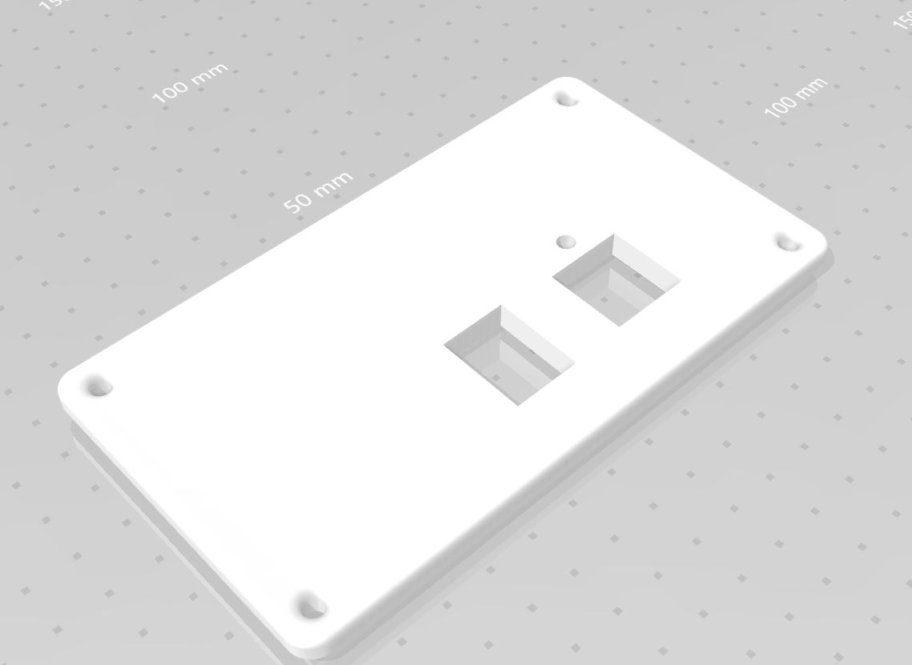
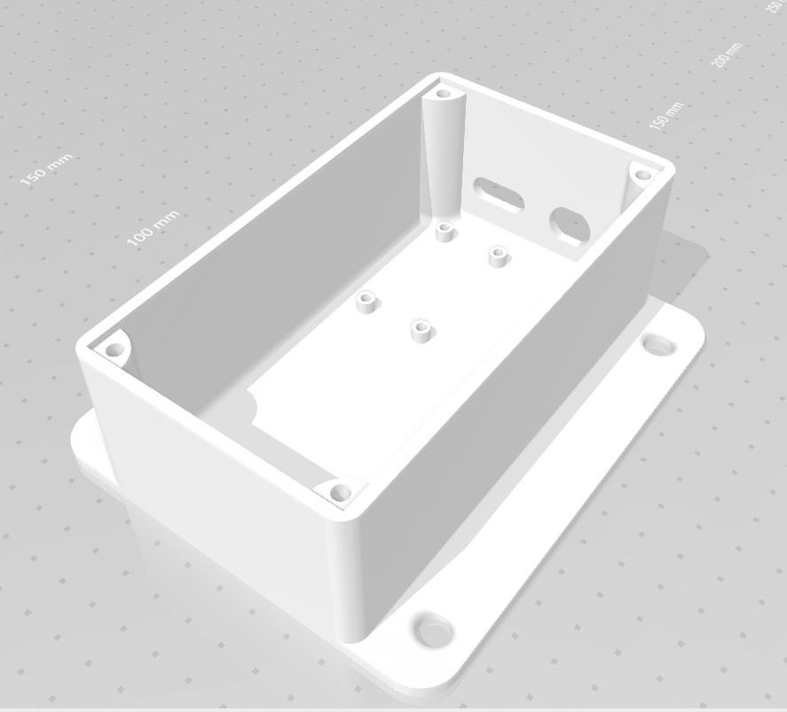
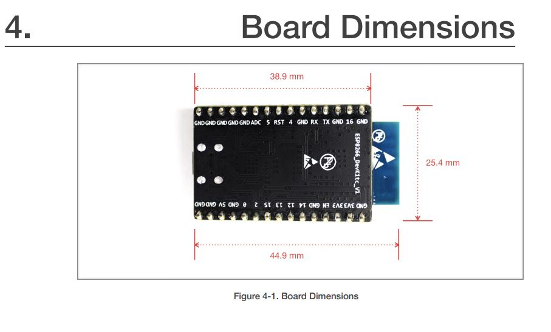
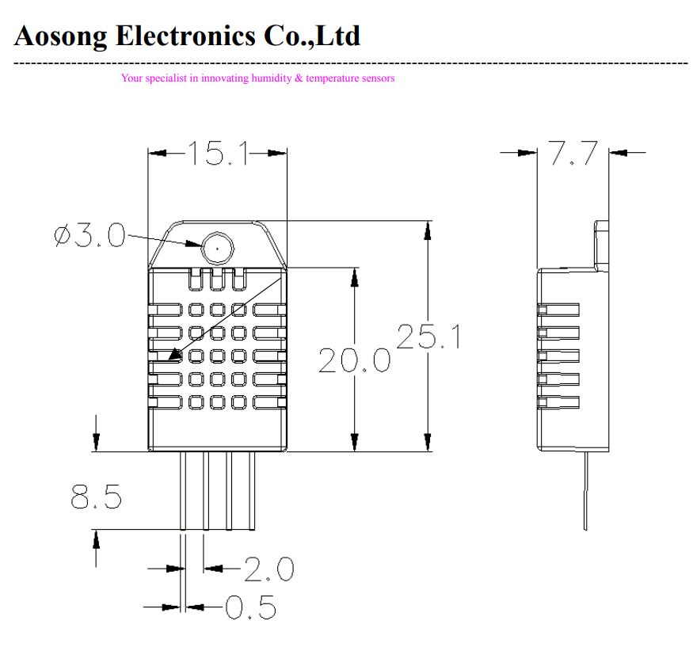
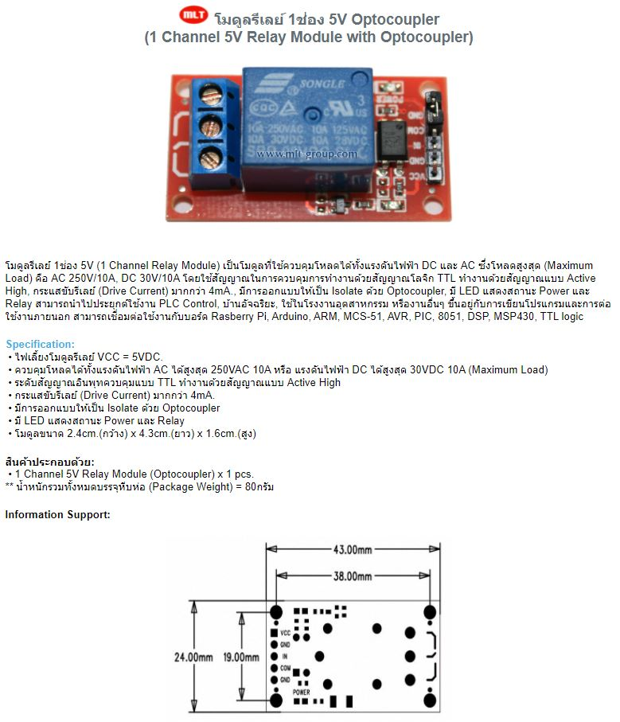
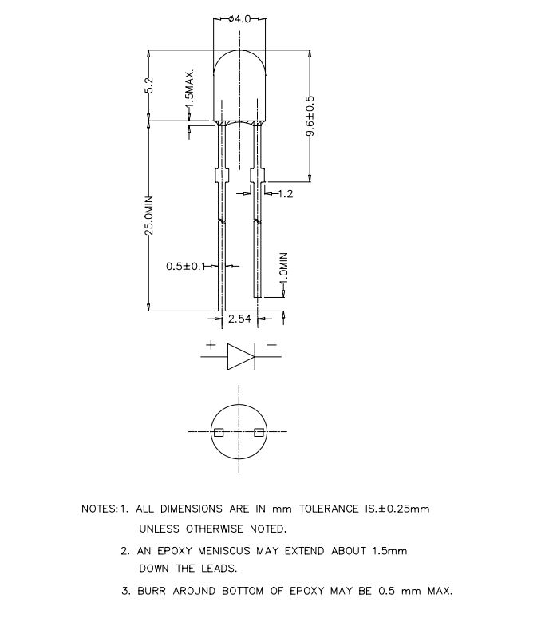
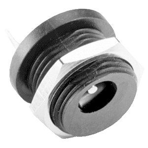
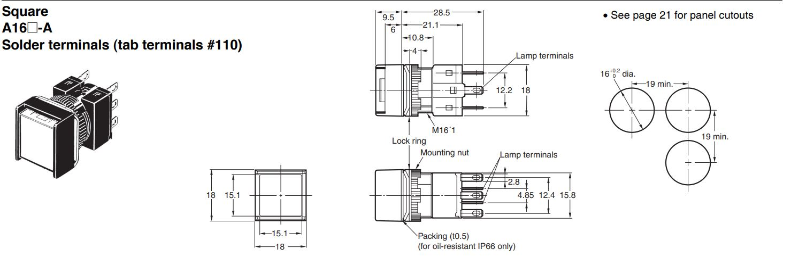

<h1> TempHumidBox</h1>
<h2>ตัวอย่างการสร้างกล่องใส่อุปกรณ์</h2>

กล่องใส่อุปกรณ์ส่วนด้านบน

กล่องใส่อุปกรณ์ส่วนด้านล่าง

<h2>อุปกรณ์ภายในกล่อง</h2>
1. ESP8266

2. Breadboard (170 holes)

3. DHT22

4. Relay Module 5v 1 Channel

5. LED 5mm

6. DC POWER JACK

7. Push Switch

